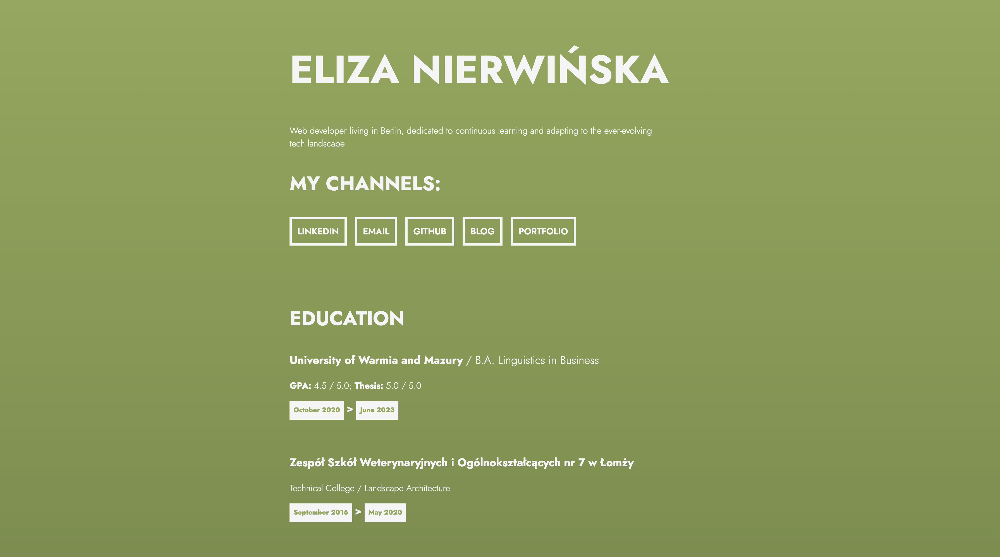

<h1 align="center">
<br>
Simplified Resume
<br>
</h1>
<h4 align="center">A simplified resume made with HTML and CSS</h4>



## Run the App

In the project directory run: 
```sh
open index.html
```

## Information about the project
This is a simple resume project made with HTML and CSS. This project was created to be displayed as a website in my portfolio Three.js project.

## This project was built with:
* HTML
* CSS
